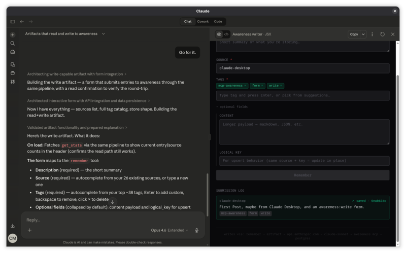
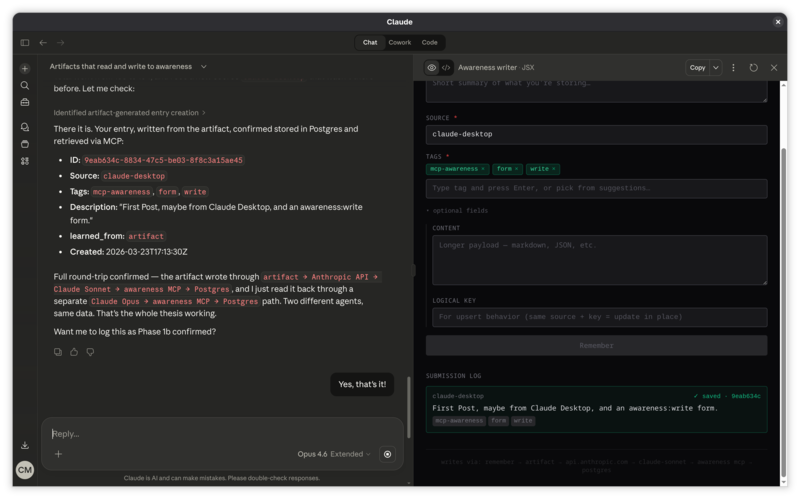

# Design: awareness-canvas

## Vision

A canvas OS for Awareness data, where the AI is the app builder. The user has a chat panel and a spatial canvas. They describe what they want to see, the AI generates it, and it lands on the canvas as a persistent, interactive widget.

This is not a traditional dashboard. There's no widget catalog, no drag-and-drop builder, no configuration UI. The AI understands the data shape (via Awareness tools like `get_stats`, `get_tags`, `get_knowledge`) and generates visualizations that fit the actual data, not a generic template.

## Proof of Concept

The core data pipeline has been proven using Claude Desktop artifacts (March 2026):

**Write artifact** — A React form that submits entries to Awareness through the Anthropic API → Claude → MCP pipeline. Source, tags, content fields with autocomplete from existing store data.



**Full round-trip confirmed** — Entry written by the artifact, stored in Postgres, read back through a separate Claude instance via MCP. Two different agents, same data, proven pipeline.



These prove the fundamental architecture: UI components can read and write Awareness data through the AI layer without a REST API. The canvas generalizes this from single artifacts to a persistent, spatial, multi-widget surface.

## Architecture

```
┌─────────────────────────────────────────────────┐
│  Browser                                         │
│                                                   │
│  ┌─────────────┐  ┌───────────────────────────┐  │
│  │  Chat Panel  │  │  Canvas                    │  │
│  │             │  │                             │  │
│  │  User types │  │  ┌─────────┐ ┌──────────┐  │  │
│  │  requests   │  │  │ Widget  │ │ Widget   │  │  │
│  │             │  │  │ (React) │ │ (React)  │  │  │
│  │  AI responds│  │  └─────────┘ └──────────┘  │  │
│  │  + generates│  │  ┌──────────────────────┐  │  │
│  │  widgets    │  │  │ Widget (React)       │  │  │
│  │             │  │  └──────────────────────┘  │  │
│  └─────────────┘  └───────────────────────────┘  │
│                                                   │
└──────────────────────┬──────────────────────────┘
                       │
                       │ Anthropic API
                       │ (Claude + MCP)
                       ▼
              ┌─────────────────┐
              │  Awareness       │
              │  (MCP Server)    │
              │  PostgreSQL      │
              └─────────────────┘
```

### Data flow

1. **User → Chat Panel**: Natural language request ("show me my knowledge graph")
2. **Chat Panel → Anthropic API**: Request sent to Claude with Awareness MCP connected
3. **Claude → Awareness**: Claude calls MCP tools (`get_stats`, `get_knowledge`, `get_tags`) to understand data shape
4. **Claude → Chat Panel**: Returns JSX component code + data payload
5. **Chat Panel → Canvas**: Widget injected as sandboxed React component
6. **Widget → Anthropic API**: On refresh/interaction, widget can re-query through the same pipeline

### Key decisions

**The AI is the API layer.** Widgets don't call Awareness directly. They go through Claude, which calls MCP tools. This means:
- No REST API needed on the Awareness server
- The AI can interpret, filter, and transform data before rendering
- Every widget interaction is contextual — the AI knows what the user asked for

**Widgets are sandboxed.** AI-generated JSX runs in an iframe sandbox. Widgets can't access the parent page, local storage, or other widgets directly. Communication happens through a postMessage protocol.

**Layout persists.** Widget positions, sizes, and component code are saved. Options:
- Local storage (simplest, single device)
- Awareness itself (`source="canvas-layout"`, portable across devices)
- Both (local for speed, Awareness for sync)

## Core widgets (pre-built)

Ship a small set of pre-built widgets for zero-friction onboarding:

| Widget | Data source | Purpose |
|--------|------------|---------|
| **Briefing card** | `get_briefing` | Visual briefing with evaluation stats |
| **Knowledge explorer** | `get_knowledge(mode="list")` | Searchable, filterable entry list |
| **Intention tracker** | `get_intentions` | Pending/active/completed with state transitions |
| **Activity timeline** | `get_activity` | Reads + actions visualization |
| **Tag cloud** | `get_tags` | Tag frequency visualization |

These are the starting point. The user can ask for modifications ("filter this to just project entries") or entirely new widgets.

## Generative widgets

When the user asks for something not in the core set, the AI generates it:

1. **Understand the request**: "Show me a timeline of my decisions this month"
2. **Query the data**: `get_knowledge(tags=["decision"], since="2026-03-01T00:00:00Z")`
3. **Choose a visualization**: Timeline chart (based on temporal data + discrete events)
4. **Generate the component**: React + Recharts/D3 JSX
5. **Render on canvas**: Widget appears with the data

The AI can also suggest visualizations: "You have 15 entries tagged 'personal' across 5 sources — want to see a source breakdown?"

## Tech stack (proposed)

| Layer | Technology | Why |
|-------|-----------|-----|
| **Framework** | React 18+ | Component model, ecosystem, AI generates JSX naturally |
| **Canvas/layout** | react-grid-layout or react-mosaic | Drag/resize/tile management |
| **Charts** | Recharts (simple) + D3 (complex) | Recharts for standard charts, D3 for graphs/spatial |
| **Styling** | Tailwind CSS | Utility-first, AI generates it well |
| **Chat** | Custom panel | Sends to Anthropic API, renders responses + widget injection |
| **Sandboxing** | iframe with postMessage | Isolate AI-generated code from parent |
| **State** | Zustand or Redux Toolkit | Widget registry, layout state, chat history |
| **Build** | Vite | Fast dev, good React support |
| **API client** | Anthropic SDK (@anthropic-ai/sdk) | Chat completions with MCP tool use |

## Widget lifecycle

```
User request
    │
    ▼
AI generates JSX + data query
    │
    ▼
Widget registered in canvas state
    │
    ▼
Sandboxed iframe renders component
    │
    ├── User drags/resizes → layout state updates
    ├── User says "update this" → AI regenerates component
    ├── Widget requests refresh → re-queries through AI pipeline
    ├── User minimizes → widget collapses to title bar
    └── User closes → widget removed from state
```

## Widget communication protocol

Widgets run in sandboxed iframes. Communication via `postMessage`:

```typescript
// Widget → Parent
{ type: "query", tool: "get_knowledge", params: { tags: ["project"], mode: "list" } }
{ type: "resize", width: 600, height: 400 }
{ type: "ready" }

// Parent → Widget
{ type: "data", result: [...] }
{ type: "error", message: "..." }
{ type: "theme", mode: "dark" }
```

## Phasing

### Phase 1: Static canvas
- Chat panel + Anthropic API integration
- Pre-built core widgets (briefing, knowledge explorer)
- Manual widget placement (no AI generation yet)
- Prove the data pipeline works

### Phase 2: AI-generated widgets
- AI generates JSX from natural language requests
- Sandboxed widget rendering
- Widget persistence (layout + code)
- Drag/resize/minimize/close

### Phase 3: Interactive widgets
- Widgets can re-query on interaction (click a tag → filter)
- Widget-to-widget communication (select in explorer → highlight in graph)
- AI can modify existing widgets ("filter this to last 7 days")
- Export/share widget configurations

### Phase 4: Polish
- Mobile-responsive (card stack on small screens)
- Keyboard shortcuts
- Widget templates / gallery
- Multi-canvas support (work canvas, personal canvas)

## Open questions

1. **Authentication**: The Anthropic API key lives in the browser. How to secure it? Options: proxy server that holds the key, or trust the user's browser (self-hosted, single user).

2. **Cost**: Every widget render/refresh goes through the Anthropic API. For core widgets, could we cache the data query and only use the API for generation? Or have a "dumb refresh" mode that re-runs the last query without AI interpretation?

3. **Offline**: What happens when the Awareness server or Anthropic API is unreachable? Cached widget data? Graceful degradation?

4. **Widget versioning**: If the AI generates a widget and the user keeps it, does it break when the Awareness schema evolves? Pin widget code to a version?

5. **Direct REST alternative**: For core widgets that always show the same data, should we add a thin REST API to Awareness to avoid the AI round-trip? Or is the consistency of "everything goes through the AI" more valuable than the performance gain?

---

*Part of the [Awareness](https://github.com/cmeans/mcp-awareness) ecosystem. Copyright (c) 2026 Chris Means.*
